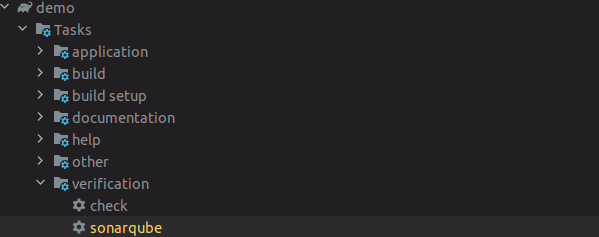
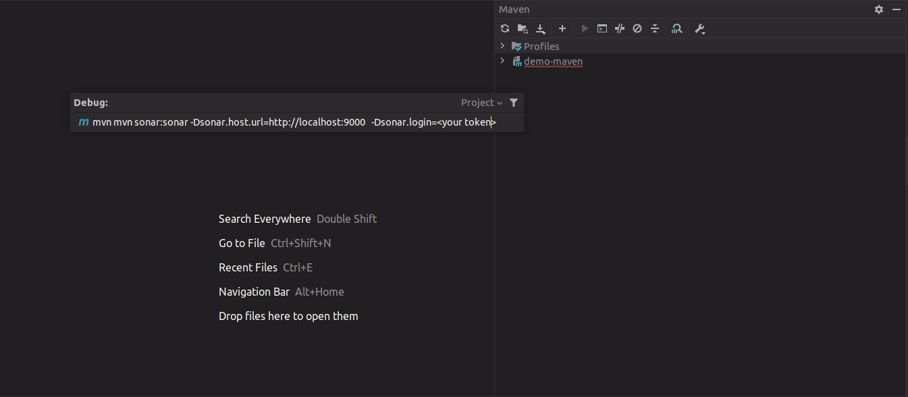
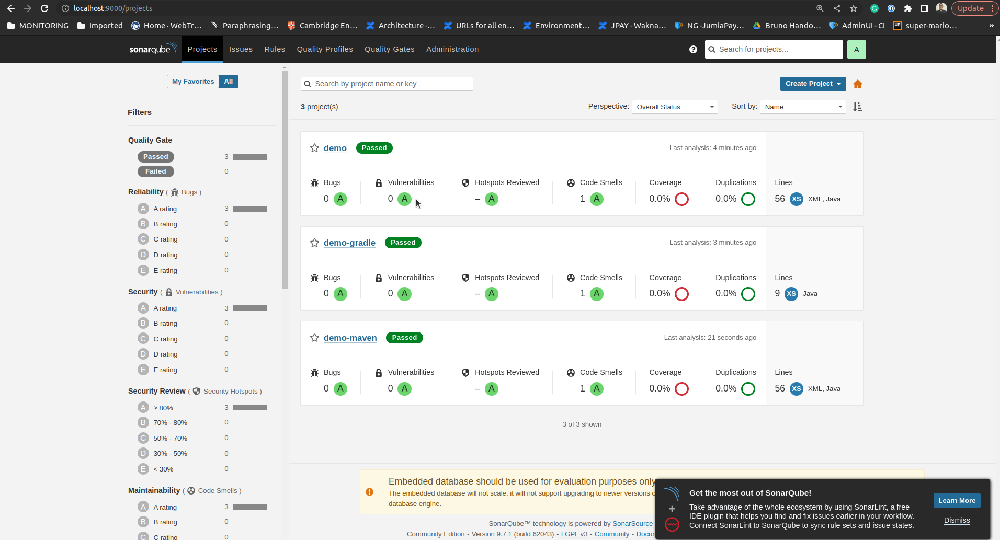

# Minumum Reproducible Sonar Plugin Example

To run the Sonar Server
```
docker-compose up -d
```

### For Gradle you can Run the sonarqube Task 


### For Maven Add the Following Command to execute

need to add the following command inside `Execute Maven Goal`
```mvn
mvn sonar:sonar -Dsonar.host.url=http://localhost:9000   -Dsonar.login=<Your Generated Token>
```
## Result :
